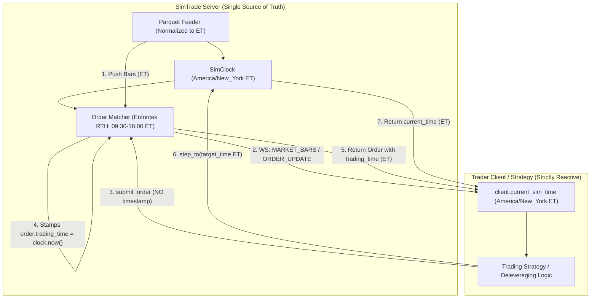

# SimTrade Time Management & Virtual Clock Specification

This document defines the architecture, principles, data flows, and API specifications for time management across the SimTrade server, feeder, matcher, and client libraries.

---

## 1. Executive Summary & Core Principles

Time management in SimTrade follows three fundamental tenets:

1. **Server is the Single Source of Truth**: The simulation clock exists solely on the SimTrade server (`SimClock`). The server dictates and advances the virtual timeline.
2. **Client is Strictly Reactive (No Client Clock)**: Trading clients (such as algorithmic runners or strategy bridges) do **not** run a clock, do **not** calculate simulation time, and **never** call `to_eastern_time(clock.now())`. Instead, the client passively reflects `client.current_sim_time` whenever the server emits an event or responds to an API call.
3. **Strict US Eastern Time (`America/New_York` ET) for Market Operations**: All simulation trading hours, bar timestamps, order timestamps, and execution fills are standardized to `America/New_York` (EDT/EST) to match US equity exchange conventions (NYSE / NASDAQ).



---

## 2. Two Distinct Starting Times

When SimTrade initializes, it defines and exposes two completely distinct timestamps:

| Metric | Property Name | Timezone | Description | Example |
| :--- | :--- | :--- | :--- | :--- |
| **Host Process Wall-Clock Start** | `local_start_time` | Host Local Time (e.g. `PDT -07:00`) | Physical wall-clock time on the server machine when `simtrade serve` was launched. | `2026-10-02T20:54:39.995297-07:00` |
| **Virtual Simulation Start** | `sim_trade_start_time` | US Eastern Time (`America/New_York`) | The timestamp of the first market bar (`timeline[0]`) in the dataset. | `2026-08-17T09:31:00-04:00` |

### Querying Metadata

Both timestamps are returned via the metadata endpoint:

```http
GET /api/v1/sim/metadata
```

**Response Payload (`200 OK`)**:
```json
{
  "local_start_time": "2026-10-02T20:54:39.995297-07:00",
  "sim_trade_start_time": "2026-08-17T09:31:00-04:00",
  "start_time": "2026-08-17T09:31:00-04:00",
  "end_time": "2026-09-25T16:00:00-04:00",
  "current_time": "2026-08-17T09:32:00-04:00",
  "total_bars": 11310,
  "current_step": 1,
  "cursor": 1,
  "progress_pct": 0.02,
  "is_finished": false,
  "speed_multiplier": 1.0,
  "is_running": false,
  "is_paused": true,
  "available_tickers": ["AAOI", "AAPL", "NVDA", "..."]
}
```

---

## 3. Data Feeder & Timestamp Ingestion

Historical market data (e.g. `data/1m_20260817_now.parquet`) often stores timestamps in UTC (for example, `13:31:00+00:00` to `20:00:00+00:00`).

### Normalization Pipeline
When `ParquetFeeder` loads historical data:
1. All timestamp indices and columns are immediately converted to `America/New_York` timezone using `to_eastern_time(...)`.
2. A UTC timestamp of `13:31:00+00:00` converts to `09:31:00-04:00` EDT.
3. A UTC timestamp of `20:00:00+00:00` converts to `16:00:00-04:00` EDT.
4. Feeder timelines (`self.timeline`) contain unique, strictly ascending `America/New_York` timestamps.

### Utility Function: `to_eastern_time`
Located in `simtrade.utils`:
```python
import zoneinfo
from datetime import datetime
from typing import Any

EASTERN_TZ = zoneinfo.ZoneInfo("America/New_York")

def to_eastern_time(dt: Any) -> datetime:
    """Normalize any datetime, timestamp, or ISO string to America/New_York timezone."""
    if dt is None:
        return None
    if isinstance(dt, str):
        # Parses ISO-8601 strings (e.g., "2026-08-17T09:31:00Z" or "2026-08-17T09:31:00-04:00")
        dt = datetime.fromisoformat(dt.replace("Z", "+00:00"))
    if hasattr(dt, "to_pydatetime"):
        dt = dt.to_pydatetime()
    if dt.tzinfo is None:
        # Naive datetimes default to Eastern Time
        dt = dt.replace(tzinfo=EASTERN_TZ)
    else:
        # Aware datetimes are converted to Eastern Time
        dt = dt.astimezone(EASTERN_TZ)
    return dt
```

---

## 4. Regular Trading Hours (RTH) Enforcement

SimTrade enforces standard US Regular Trading Hours:

- **Market Open**: `09:30:00 ET`
- **Market Close**: `16:00:00 ET`
- **Trading Days**: Monday through Friday (excluding exchange holidays).

### Order Rejection Policy
Pre-market and post-market trading is disabled by default:
- Any order submitted with server simulation clock `< 09:30:00 ET` or `> 16:00:00 ET` is rejected immediately:
  ```json
  HTTP 400 Bad Request
  {
    "detail": "Market is closed: Post-market trading is disabled (order time: 16:17:00 ET). Regular trading hours are 09:30-16:00 ET."
  }
  ```
- End-of-day risk checks or margin deleveraging (e.g. trimming leverage before close) must execute during regular hours (typically at **15:55:00 ET**).

### Visual UI Representation
On the Web Dashboard (`/dashboard`):
- Market close intervals are indicated with distinct background shading and vertical demarcation bars.
- Live clock shows both host local time and current simulation Eastern Time.

---

## 5. Order Submission & Server Timestamping

### Client Request Payload: No Time Allowed
The client **must never** supply a timestamp in order requests. Order timestamps supplied by the client are prone to clock drift, tampering, and synchronization errors.

The `OrderCreate` schema strictly contains only order parameters:
```python
class OrderCreate(BaseModel):
    ticker: str
    side: OrderSide              # BUY, SELL, SELL_SHORT
    order_type: OrderType        # MARKET, LIMIT, STOP, STOP_LIMIT
    quantity: float
    limit_price: Optional[float] = None
    stop_price: Optional[float] = None
    time_in_force: TimeInForce = TimeInForce.GTC
    client_order_id: Optional[str] = None
```

### Server Assignment
When the server receives an order:
```python
# Server-side order receipt in Simulator / OrderEngine
virtual_sim_time = to_eastern_time(self.clock.now())
order.trading_time = virtual_sim_time
order.sim_created_at = virtual_sim_time
```

The resulting `Order` model returned to the client contains the authoritative `trading_time` in US Eastern Time.

---

## 6. Reactive Client Sim-Time Tracking

Trading clients maintain an internal attribute:
```python
self.current_sim_time: Optional[datetime] = None
```

The client updates `current_sim_time` reactively across all incoming communication channels:

```python
def _update_sim_time(self, raw_time: Any) -> Optional[datetime]:
    if not raw_time:
        return None
    dt = datetime.fromisoformat(str(raw_time).replace("Z", "+00:00"))
    if self.current_sim_time is None or dt > self.current_sim_time:
        self.current_sim_time = dt
        for h in self._on_time_handlers:
            asyncio.create_task(h(self.current_sim_time))
    return self.current_sim_time
```

### Update Triggers

| Channel | Server Event / API | Extracted Field | Effect on Client |
| :--- | :--- | :--- | :--- |
| **WebSocket** | `MARKET_BARS` | `m_data["timestamp"]` or `bar.sim_timestamp` | Updates `current_sim_time` to bar close time; triggers `on_bar` and `on_time`. |
| **WebSocket** | `ORDER_UPDATE` | `order.sim_updated_at` or `order.trading_time` | Updates `current_sim_time`; triggers `on_order`. |
| **WebSocket** | `TRADE_EXECUTION` | `trade.timestamp` | Updates `current_sim_time`; triggers `on_trade`. |
| **REST** | `POST /api/v1/orders` | `order.trading_time` | Immediately informs client of current sim time at order placement. |
| **REST** | `POST /api/v1/sim/step_to` | `data["current_time"]` | Fast-forwards client's tracked time to target timestamp. |
| **REST** | `POST /api/v1/sim/step` | `data["current_time"]` | Advances client's tracked time by N minutes. |
| **REST** | `GET /api/v1/sim/status` | `data["current_time"]` | Synchronizes client's tracked time on poll. |

### Client-Side Time Hook Decorator
Clients can listen to simulation time advances directly:
```python
client = SimTradeClient(base_url="http://127.0.0.1:6688")

@client.on_time
async def handle_time_advanced(current_time: datetime):
    if current_time.hour == 15 and current_time.minute == 55:
        # Execute end-of-day deleveraging
        await client.sell(ticker="AAOI", quantity=50)
```

---

## 7. Fast-Forwarding Time: `step_to` API

For stepped backtests and scheduled replay passes, the server provides:

```http
POST /api/v1/sim/step_to
Content-Type: application/json

{
  "target_time": "2026-08-17T15:55:00-04:00",
  "account_id": "trader_1"
}
```

### Server Behavior
1. Validates and converts `target_time` to `America/New_York` using `to_eastern_time(...)`.
2. Iterates the simulation cursor step-by-step up to the closest matching bar in the timeline.
3. For each step:
   - Advances `self.clock.step()`.
   - Dispatches market bars to active accounts and queues.
   - Triggers order matcher limit/stop evaluations.
4. Returns:
   ```json
   {
     "status": "stepped_to",
     "target_time": "2026-08-17T15:55:00-04:00",
     "current_time": "2026-08-17T15:55:00-04:00",
     "current_step": 385,
     "bars_drained": 385
   }
   ```
5. Client immediately updates `client.current_sim_time = "2026-08-17T15:55:00-04:00"`.

---

## 8. Summary Table of Time Semantics

| Component | Responsibility | Allowed Actions | Disallowed Actions |
| :--- | :--- | :--- | :--- |
| **Server Clock (`SimClock`)** | Maintain simulation timeline in ET. | Advance step, set speed, return `now()`. | Do not use local machine time for sim events. |
| **Server Feeder (`Feeder`)** | Ingest OHLCV data. | Convert all timestamps to `America/New_York`. | Never output mixed or UTC timestamps to the clock. |
| **Server Matcher (`Matcher`)** | Validate order times & match trades. | Enforce RTH (09:30-16:00 ET); reject closed market orders. | Never trust client-submitted timestamps. |
| **Client (`SimTradeClient`)** | Stream events & place orders. | Passively track `client.current_sim_time` from server responses. | **Never run a clock; never call `clock.now()`.** |
| **Strategy Bridge / Runner** | Generate signals & submit orders. | Plan schedule in ET; call `step_to(target_time)`. | Never send timestamps in `submit_order`. |
