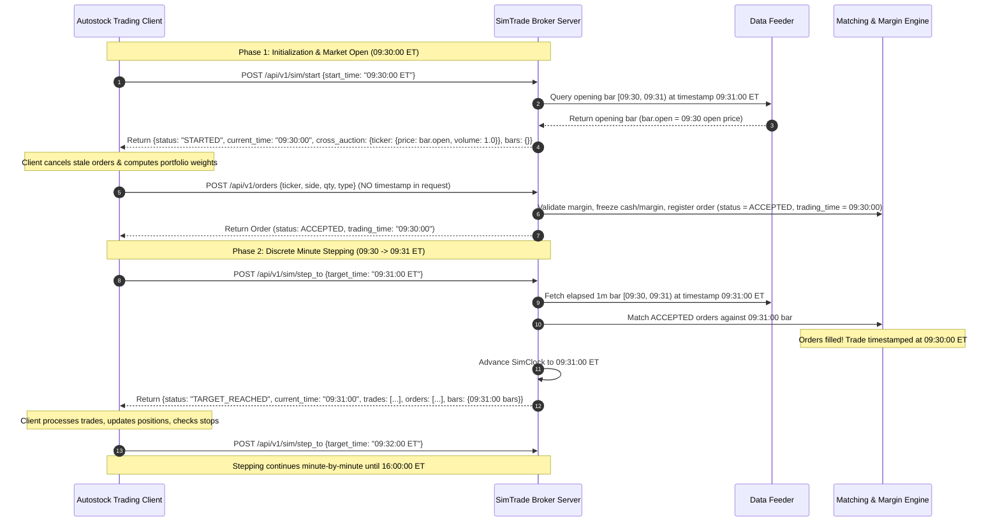

# SimTrade & Autostock Time Management & Causality Specification

This document provides a comprehensive, end-to-end specification of time management, discrete clock advancement, order matching causality, and market data alignment across the **SimTrade broker server** and **Autostock trading client**.

---

## 1. Executive Summary & Architectural Principles

Time management between SimTrade and Autostock is built on **pure discrete simulation time** standardized strictly to **US Eastern Time (`America/New_York` ET)**. All continuous wall-clock anchors, speed multipliers, and local-to-virtual time scaling have been eliminated in favor of a deterministic, client-driven discrete stepping loop.



### Core Tenets

1. **Server is the Single Source of Truth**: The simulation clock exists solely on the SimTrade server (`SimClock`). The server dictates and advances the virtual timeline.
2. **Client is Strictly Reactive (No Client Clock)**: Algorithmic clients and strategy bridges do **not** run an internal clock, do **not** calculate simulation time from host wall-clock time, and **never** call `to_eastern_time(clock.now())`. The client's tracked time (`client.current_sim_time`) updates reactively from server responses.
3. **No Timestamps in Order Requests**: Order payloads submitted by clients **never** contain a timestamp. The server stamps the order at the current virtual simulation time in Eastern Time upon receipt.
4. **Discrete Causality & Deferred Matching**: Orders submitted at minute $T$ enter status `ACCEPTED` (pending). They are **not matched immediately**. When the client calls `step_to(T + 1m)`, the server matches pending orders against the elapsed 1-minute bar $[T, T+1\text{m})$, fills the orders at prices on that bar, timestamps the execution fills at $T$, advances the server clock to $T+1\text{m}$, and returns the results to the client.
5. **Strict US Eastern Time (`America/New_York` ET)**: All simulation trading hours, dataset bars, order timestamps, and execution fills are standardized to `America/New_York` (EDT/EST) to match US equity exchange conventions (NYSE / NASDAQ).

---

## 2. Two Distinct Starting Times

When SimTrade initializes, it defines and exposes two distinct timestamps:

| Metric | Property Name | Timezone | Description | Example |
| :--- | :--- | :--- | :--- | :--- |
| **Host Process Wall-Clock Start** | `local_start_time` | Host Local Time (e.g. `PDT -07:00`) | Physical wall-clock time on the server machine when `simtrade serve` was launched. | `2026-10-02T20:54:39-07:00` |
| **Virtual Simulation Start** | `sim_trade_start_time` | US Eastern Time (`America/New_York`) | The virtual session open time (`09:30:00 ET`) on the first trading date in the dataset. | `2026-08-17T09:30:00-04:00` |

### Querying Simulation Metadata

```http
GET /api/v1/sim/metadata
```

**Response Payload (`200 OK`)**:
```json
{
  "local_start_time": null,
  "sim_trade_start_time": "2026-08-17T09:30:00-04:00",
  "start_time": "2026-08-17T09:30:00-04:00",
  "end_time": "2026-09-25T16:00:00-04:00",
  "trading_dates": [
    "2026-08-17",
    "2026-08-18",
    "2026-08-19",
    "2026-08-20",
    "2026-08-21",
    "2026-08-24",
    "2026-08-25",
    "2026-09-04",
    "2026-09-08"
  ],
  "current_time": "2026-08-17T09:30:00-04:00",
  "total_bars": 11310,
  "current_step": 0,
  "cursor": 0,
  "progress_pct": 0.0,
  "is_finished": false,
  "speed_multiplier": 1.0,
  "is_running": false,
  "is_paused": false,
  "available_tickers": ["AAOI", "AAPL", "NVDA", "..."],
  "active_accounts": ["trader_1"]
}
```

> [!NOTE]
> `trading_dates` enumerates the exact calendar dates present in the market dataset. Weekends and exchange holidays (e.g. Labor Day on `2026-09-07`) are automatically excluded, allowing clients to jump across overnight gaps without guessing non-trading dates.

---

## 3. Bar-End Timestamping & Historical Data Alignment

### The Bar-End Timestamp Convention

In standard financial market datasets (including SimTrade's `1m_20260817_now.parquet`), 1-minute OHLCV bars use **bar-end timestamping**:

- The 1-minute bar covering interval $[09:30:00, 09:31:00)$ is timestamped **`09:31:00-04:00`**.
- The 1-minute bar covering interval $[15:59:00, 16:00:00)$ is timestamped **`16:00:00-04:00`**.
- There are exactly 390 bars per trading day: timestamps range from `09:31:00` through `16:00:00`.
- **There is NO bar timestamped `09:30:00` in the historical dataset.**

### Alignment Rules in SimTrade Engine

To maintain strict causal alignment with bar-end datasets:

1. **Interval Query**: When stepping from `current_ts = T` to `interval_end = T + 1m`, the market bar covering $[T, T+1\text{m})$ is retrieved at timestamp **`interval_end`**:
   ```python
   # In simulator.py step_to()
   interval_end = min(current_ts + timedelta(minutes=1), target_ts)
   bars = self.feeder.get_bars_for_time(interval_end)
   ```
2. **Opening Auction Reference (09:30:00 ET)**: At `09:30:00 ET`, the session has just opened. The opening auction reference prices are extracted from the `open` price of the first bar $[09:30, 09:31)$, which is located at `09:31:00 ET`:
   ```python
   # At 09:30:00 ET market open
   open_bar_time = current_ts + timedelta(minutes=1) # 09:31:00 ET
   open_bars = self.feeder.get_bars_for_time(open_bar_time)
   cross_auction = {t: {"price": b.open, "volume": 1.0} for t, b in open_bars.items()}
   ```
3. **Empty Bars Payload at 09:30:00 ET**: Because no 1-minute bar has completed at `09:30:00 ET`, the server returns `"bars": {}` in `start(09:30)` and in overnight gap `step_to(09:30)`. This ensures client `on_bar` callbacks are not prematurely fired before the client has an opportunity to cancel stale orders and submit opening orders.
4. **Feeder Inactive-Time Lookup**: If `timestamp` is not present in the dataset's `_bars_by_time` index (e.g. `09:30:00`, overnight, weekends, holidays), `feeder.get_bars_for_time(timestamp)` returns `{}` immediately. It never manufactures synthetic 0-volume carry-forward bars during non-trading minutes.

---

## 4. Discrete Simulation Lifecycle: Step-by-Step

### Phase 1: Simulation Setup & Start (`09:30:00 ET`)

1. Client requests simulation start at session open:
   ```http
   POST /api/v1/sim/start
   Content-Type: application/json
   
   {"start_time": "2026-08-17T09:30:00-04:00"}
   ```
2. Server sets `clock.current_time = 2026-08-17T09:30:00-04:00`.
3. Server queries the `09:31:00 ET` bar to extract opening prices (`bar.open`) and returns:
   ```json
   {
     "status": "STARTED",
     "current_time": "2026-08-17T09:30:00-04:00",
     "cross_auction": {
       "AAOI": {"price": 152.65, "volume": 1.0},
       "LUNR": {"price": 20.25, "volume": 1.0}
     }
   }
   ```

---

### Phase 2: Opening Auction Entry & Order Placement (`09:30:00 ET`)

1. Client receives `cross_auction` with reference prices.
2. Client cancels any lingering active orders from previous sessions:
   ```http
   DELETE /api/v1/orders/{order_id}
   ```
3. Client computes target allocations and submits morning orders:
   ```http
   POST /api/v1/orders
   Content-Type: application/json
   
   {
     "ticker": "AAOI",
     "side": "BUY",
     "order_type": "MARKET",
     "quantity": 962.0
   }
   ```
4. **Server Handling**:
   - The server validates account margin and purchasing power.
   - Calculates frozen margin/cash (using base price + slippage buffer for market orders).
   - Stamps `order.trading_time = 2026-08-17T09:30:00-04:00`.
   - Registers the order in `MatchingEngine.active_orders` with status `ACCEPTED`.
   - Records `ORDER_ACCEPTED` in the event ledger.
   - Returns the order to the client. Orders remain pending, awaiting matching.

---

### Phase 3: First Minute Stepping & Deferred Matching (`09:30 -> 09:31 ET`)

1. Client finishes placing orders for `09:30:00 ET` and advances simulation by 1 minute:
   ```http
   POST /api/v1/sim/step_to
   Content-Type: application/json
   
   {"target_time": "2026-08-17T09:31:00-04:00", "account_id": "trader_1"}
   ```
2. **Server Execution**:
   - Retrieves the elapsed bar for interval $[09:30, 09:31)$ via `feeder.get_bars_for_time("09:31:00-04:00")`.
   - Matches all `ACCEPTED` orders against this bar (calculating execution price with slippage and volume participation limits).
   - For filled orders:
     - Sets `order.status = FILLED`.
     - Generates `Trade` with `sim_timestamp = 2026-08-17T09:30:00-04:00`.
     - Updates account positions, cash, and releases frozen cash.
     - Records `ORDER_FILLED` in the event ledger.
   - Advances server clock to `2026-08-17T09:31:00-04:00`.
   - Updates account mark prices and checks maintenance margin.
3. Server returns the step response:
   ```json
   {
     "status": "TARGET_REACHED",
     "current_time": "2026-08-17T09:31:00-04:00",
     "bars_processed": 1,
     "trades": [
       {
         "trade_id": "1d826992-aa36-4f54-acda-4407dc090630",
         "order_id": "989fd54f-b981-4541-9160-d8b01cc87aec",
         "ticker": "AAOI",
         "side": "BUY",
         "price": 152.68,
         "quantity": 962.0,
         "sim_timestamp": "2026-08-17T09:30:00-04:00"
       }
     ],
     "orders": [...],
     "bars": {
       "AAOI": {"open": 152.65, "high": 153.20, "low": 152.40, "close": 152.90, "volume": 45200.0}
     },
     "account": {...}
   }
   ```
4. **Client Reception**:
   - Updates `client.current_sim_time = 2026-08-17T09:31:00-04:00`.
   - Dispatches `trades` to `bridge.on_trade()` (updating position trackers and entry prices).
   - Dispatches `bars` to `bridge.on_bar()` (updating intraday price high-water marks).
   - Dispatches `account` to account listeners.

---

### Phase 4: Intraday Continuous Stepping (`09:31 -> 15:55 ET`)

The client repeatedly calls `step_to(T + 1m)`:
- **At 10:00 ET (30m ORB Checkpoint)**: Client checks 30-minute returns. Positions with negative returns are cut (`SELL MARKET`), while winners are held or pyramided.
- **Continuous Trailing Stops**: If a bar breaches an initial hard stop (e.g. $-3.5\%$) or dynamic trailing stop, `client.sell()` is submitted. It is matched on the next 1m step.
- **At 15:55 ET (EOD De-leveraging Checkpoint)**: If gross leverage exceeds $1.0\times$, client submits market sell orders to trim positions so overnight leverage $\le 1.0\times$.

---

### Phase 5: Market Close & Overnight Gap Jump (`16:00 ET -> Next Day 09:30 ET`)

1. At `16:00:00 ET`, regular trading hours end.
2. Client cancels any lingering active orders:
   ```python
   await client.cancel_all_active_orders()
   ```
3. Client identifies the next valid trading date from `meta["trading_dates"]`:
   ```python
   trading_dates = [datetime.fromisoformat(d).date() for d in meta.get("trading_dates", [])]
   next_date = next((d for d in trading_dates if d > curr_date), None)
   next_open_ny = datetime.combine(next_date, time(9, 30), tzinfo=ny_tz)
   ```
4. Client requests a jump across the non-trading gap:
   ```http
   POST /api/v1/sim/step_to
   Content-Type: application/json
   
   {"target_time": "2026-08-18T09:30:00-04:00", "account_id": "trader_1"}
   ```
5. **Server Handling**:
   - Detects `current_ts.time() >= time(16, 0)`.
   - Jumps server clock directly to target: `clock.set_time("2026-08-18T09:30:00-04:00", reason="GAP_JUMP")`.
   - Queries `09:31:00 ET` bar of Day 2 to compute Day 2 opening cross auction.
   - Sets `last_bars = {}` (no bars elapsed during the overnight gap).
   - Returns `{status: "TARGET_REACHED", current_time: "2026-08-18T09:30:00", cross_auction: {...}, bars: {}, trades: []}`.
6. **Client Handling at Next Day 09:30:00 ET**:
   - Client clock arrives at `09:30:00 ET`.
   - Cancels stale orders.
   - Evaluates Day 2 morning alpha selections via `bridge.handle_market_open(cross_auction, current_t)`.
   - Submits Day 2 rebalance exit orders (e.g. `AAOI SELL 649.00`) and new open buys (e.g. `CBRS BUY`, `GE BUY`).
   - Steps to `09:31:00 ET`, where Day 2 morning orders are matched and filled.

---

## 5. Order Matching & Causality Rules

```
Order Submissions at minute T:
=============================================================================
  T = 09:30:00 ET     Client places BUY AAOI (962 shares)
                      Server: Margin checked, status = ACCEPTED, trading_time = 09:30:00

Stepping to minute T + 1m:
=============================================================================
  step_to(09:31:00)   Server retrieves bar [09:30, 09:31) (timestamped 09:31:00 ET)
                      Order matched! Status = FILLED, Price = $152.68
                      Trade recorded with sim_timestamp = 09:30:00 ET
                      Clock advances to 09:31:00 ET
                      Response returned with trades, orders, and 09:31:00 bar
```

### Order Types & Pricing Semantics

1. **Market Order**:
   - **Buy**: Fills at $\text{open} \times (1 + \text{slippage\_bps} / 10\,000)$, capped within $[\text{low}, \text{high}]$.
   - **Sell**: Fills at $\text{open} \times (1 - \text{slippage\_bps} / 10\,000)$, capped within $[\text{low}, \text{high}]$.
2. **Limit Order**:
   - **Buy**: Fills if $\text{bar.low} \le \text{limit\_price}$. Fill price is $\min(\text{limit\_price}, \text{bar.open})$.
   - **Sell**: Fills if $\text{bar.high} \ge \text{limit\_price}$. Fill price is $\max(\text{limit\_price}, \text{bar.open})$.
3. **Stop Order**:
   - **Buy**: Triggers if $\text{bar.high} \ge \text{stop\_price}$. Fill price is $\max(\text{stop\_price}, \text{bar.open})$.
   - **Sell**: Triggers if $\text{bar.low} \le \text{stop\_price}$. Fill price is $\min(\text{stop\_price}, \text{bar.open})$.
4. **Volume Participation Cap**:
   - Each order fill is capped at $\text{max\_volume\_share} \times \text{bar.volume}$ (default: $10\%$). If an order quantity exceeds the remaining volume capacity of the 1m bar, it partially fills and the remainder stays `PARTIALLY_FILLED` for subsequent bars.

---

## 6. Client API & Reactive Time Methods

### Client Configuration

```python
from simtrade_client.client import SimTradeClient

client = SimTradeClient(
    base_url="http://127.0.0.1:6688",
    account_id="trader_1",
)
```

### Core Stepping Methods

| Method | Endpoint | Purpose |
| :--- | :--- | :--- |
| `await client.start_sim(start_time)` | `POST /api/v1/sim/start` | Starts simulation at specified ET timestamp. Returns `cross_auction`. |
| `await client.step_to(target_time)` | `POST /api/v1/sim/step_to` | Advances simulation to target ET timestamp. Synchronously dispatches trades, orders, and bars. |
| `await client.cancel_all_active_orders()` | `DELETE /api/v1/orders/{id}` | Immediately cancels all unfilled `ACCEPTED` orders for the account. |
| `await client.get_account()` | `GET /api/v1/account` | Retrieves authoritative equity, cash, margin, and positions ledger. |
| `await client.get_metadata()` | `GET /api/v1/sim/metadata` | Queries simulation status, `sim_trade_start_time`, and verified `trading_dates`. |

### Reactive Event Handlers

```python
# Trade Execution Callback
@client.on_trade
async def on_trade(trade: Trade):
    print(f"[FILL] {trade.side} {trade.quantity} {trade.ticker} @ ${trade.price:.2f}")

# 1-Minute Bar Callback
@client.on_bar
async def on_bar(bars: Dict[str, Bar]):
    sample = next(iter(bars.values()))
    print(f"[BAR] Sim Time: {sample.sim_timestamp} | Received {len(bars)} ticker bars")

# Order Update Callback
@client.on_order
async def on_order(order: Order):
    print(f"[ORDER UPDATE] {order.order_id}: {order.status}")
```

---

## 7. Web UI & Visualization Standards

On the SimTrade Web Dashboard (`/dashboard`):

1. **Strict Eastern Time Display**: All chart x-axes, event log timestamps, and trade inspection tables are rendered in **US Eastern Time (`America/New_York` ET)**.
2. **Alternating Daily Shading**: Consecutive trading days are differentiated with alternating contrasting background fills so day boundaries are instantly identifiable.
3. **Removal of Non-Trading Bar Gaps**: Non-market intervals (overnight gaps from 16:00 to 09:30 and weekend spans) are completely omitted from equity and asset trend graphs. The timeline transitions seamlessly from Day $N$ 16:00 to Day $N+1$ 09:30.
4. **Non-Overlapping Stacked Composition**:
   - **Cash Component**: Always anchored at the base of the area chart (bottom layer).
   - **Position Components**: Position layers are sorted strictly by the ticker's first share acquisition timestamp, ensuring area ribbons never jump or overlap.

---

## 8. Summary Table of Component Invariants

| Component | Responsibility | Invariants |
| :--- | :--- | :--- |
| **Server Clock (`SimClock`)** | Single source of simulation time. | Strictly `America/New_York`. Advances only via `step()` or `step_to()`. No wall-clock drift. |
| **Data Feeder (`DataFeeder`)** | Ingest and index 1m OHLCV data. | Timestamps normalized to ET. Returns `{}` for inactive timestamps. Returns bar at $T+1\text{m}$ for interval $[T, T+1\text{m})$. |
| **Matcher (`MatchingEngine`)** | Order matching & volume capping. | Orders submitted at $T$ remain `ACCEPTED` until stepped. Filled against elapsed bar. Trade timestamp = $T$. |
| **Trading Client (`SimTradeClient`)** | Reactive simulation driver. | **Never runs an internal clock.** Dispatches server results synchronously. Does not send timestamps in orders. |
| **Strategy Bridge / Runner** | Signal generation & portfolio management. | Cancels stale orders before session open. Submits morning orders at 09:30:00 ET. Jumps overnight using verified `trading_dates`. |
